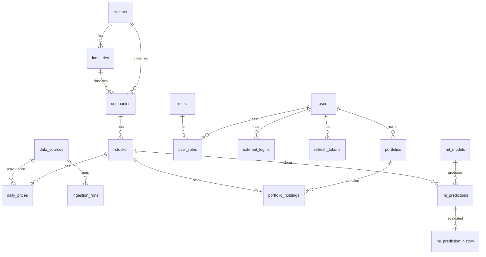

# Finance Analysis Platform

Collect, store, analyze, and visualize equity market data. Machine learning lives in a separate app (`MLPipeline_Jordan/`); this platform only reads prediction tables.

## Stack

- **Frontend:** React 19, TypeScript 6, Vite 8, Tailwind 4, React Router, TanStack Query, Axios, React Hook Form, Zod
- **Backend:** ASP.NET Core 10, EF Core, PostgreSQL, Clean Architecture
- **Market data:** Pluggable providers (default: mock; production-ready: Polygon.io)

## Database model

PostgreSQL schema managed by EF Core migrations (`backend/src/FinanceAnalysis.Infrastructure/Persistence/Migrations/`). Physical names are snake_case. String enums are stored as `varchar`. ML tables (`ml_*`) are written by `MLPipeline_Jordan/` and read by this API.



### Catalog

#### `sectors`

| Column | Type | Nullable | Notes |
|--------|------|----------|-------|
| `id` | `integer` | no | PK, identity |
| `key` | `varchar(64)` | no | Unique (e.g. `InformationTechnology`) |
| `name` | `varchar(128)` | no | Display name |
| `display_order` | `integer` | no | |

Seeded with the eleven GICS sectors.

#### `industries`

| Column | Type | Nullable | Notes |
|--------|------|----------|-------|
| `id` | `integer` | no | PK, identity |
| `sector_id` | `integer` | no | FK → `sectors.id` |
| `name` | `varchar(160)` | no | Unique per sector |

#### `companies`

| Column | Type | Nullable | Notes |
|--------|------|----------|-------|
| `id` | `integer` | no | PK, identity |
| `name` | `varchar(256)` | no | |
| `sector_id` | `integer` | yes | FK → `sectors.id` (ON DELETE SET NULL) |
| `industry_id` | `integer` | yes | FK → `industries.id` (ON DELETE SET NULL) |
| `cik` | `varchar(16)` | yes | SEC CIK |
| `country_code` | `varchar(2)` | yes | |
| `homepage_url` | `varchar(512)` | yes | |
| `description` | `varchar(4000)` | yes | |
| `employee_count` | `integer` | yes | |
| `listed_on` | `date` | yes | |
| `profile_refreshed_at` | `timestamptz` | yes | |
| `created_at` | `timestamptz` | no | |
| `updated_at` | `timestamptz` | no | |

#### `stocks`

| Column | Type | Nullable | Notes |
|--------|------|----------|-------|
| `id` | `integer` | no | PK, identity |
| `symbol` | `varchar(16)` | no | Unique ticker |
| `company_id` | `integer` | no | FK → `companies.id` |
| `exchange` | `varchar(16)` | yes | MIC, e.g. `XNAS` |
| `currency_code` | `varchar(3)` | no | |
| `asset_type` | `varchar(32)` | no | Enum string |
| `is_tracked` | `boolean` | no | In active universe |
| `tracked_since` | `timestamptz` | yes | |
| `untracked_at` | `timestamptz` | yes | |
| `delisted_on` | `date` | yes | |
| `created_at` | `timestamptz` | no | |
| `updated_at` | `timestamptz` | no | |

Rows are not deleted when removed from the universe; `is_tracked` is cleared so price history remains.

### Identity / auth

#### `users`

| Column | Type | Nullable | Notes |
|--------|------|----------|-------|
| `id` | `uuid` | no | PK |
| `email` | `varchar(256)` | no | |
| `normalized_email` | `varchar(256)` | no | Unique lookup key |
| `password_hash` | `varchar(256)` | yes | Null for OAuth-only accounts |
| `display_name` | `varchar(128)` | no | |
| `is_active` | `boolean` | no | Default `true` |
| `last_login_at` | `timestamptz` | yes | |
| `created_at` | `timestamptz` | no | |
| `updated_at` | `timestamptz` | no | |

#### `roles`

| Column | Type | Nullable | Notes |
|--------|------|----------|-------|
| `id` | `integer` | no | PK, identity |
| `name` | `varchar(64)` | no | |
| `normalized_name` | `varchar(64)` | no | Unique |
| `description` | `varchar(256)` | no | |

Seeded: `Administrator`, `Member`.

#### `user_roles`

| Column | Type | Nullable | Notes |
|--------|------|----------|-------|
| `user_id` | `uuid` | no | PK, FK → `users.id` (CASCADE) |
| `role_id` | `integer` | no | PK, FK → `roles.id` |
| `assigned_at` | `timestamptz` | no | |

#### `external_logins`

| Column | Type | Nullable | Notes |
|--------|------|----------|-------|
| `id` | `uuid` | no | PK |
| `user_id` | `uuid` | no | FK → `users.id` (CASCADE) |
| `provider` | `varchar(64)` | no | |
| `provider_key` | `varchar(256)` | no | Unique with `provider` |
| `linked_at` | `timestamptz` | no | |

#### `refresh_tokens`

| Column | Type | Nullable | Notes |
|--------|------|----------|-------|
| `id` | `uuid` | no | PK |
| `user_id` | `uuid` | no | FK → `users.id` (CASCADE) |
| `token_hash` | `varchar(64)` | no | Unique (SHA-256 / Base64) |
| `expires_at` | `timestamptz` | no | |
| `created_at` | `timestamptz` | no | |
| `created_by_ip` | `varchar(64)` | yes | |
| `revoked_at` | `timestamptz` | yes | |
| `replaced_by_token_hash` | `varchar(64)` | yes | Rotation chain |

### Market data / ingestion

#### `data_sources`

| Column | Type | Nullable | Notes |
|--------|------|----------|-------|
| `id` | `integer` | no | PK, identity |
| `key` | `varchar(32)` | no | Unique (`polygon`, `mock`, …) |
| `name` | `varchar(128)` | no | |

#### `daily_prices`

| Column | Type | Nullable | Notes |
|--------|------|----------|-------|
| `id` | `bigint` | no | PK, identity |
| `stock_id` | `integer` | no | FK → `stocks.id` |
| `trade_date` | `date` | no | Unique with `stock_id` |
| `open` | `numeric(18,6)` | no | |
| `high` | `numeric(18,6)` | no | |
| `low` | `numeric(18,6)` | no | |
| `close` | `numeric(18,6)` | no | |
| `volume` | `bigint` | no | |
| `volume_weighted_average_price` | `numeric(18,6)` | yes | VWAP |
| `transaction_count` | `integer` | yes | |
| `data_source_id` | `integer` | no | FK → `data_sources.id` |
| `ingested_at` | `timestamptz` | no | |

Checks: `high >= low`; OHLC `> 0`; `volume >= 0`. Append-only (duplicate `(stock_id, trade_date)` ignored on ingest).

#### `ingestion_runs`

| Column | Type | Nullable | Notes |
|--------|------|----------|-------|
| `id` | `uuid` | no | PK |
| `run_type` | `varchar(32)` | no | e.g. DailyPrices, HistoricalBackfill, UniverseSync |
| `status` | `varchar(32)` | no | Queued, Running, Succeeded, … |
| `data_source_id` | `integer` | no | FK → `data_sources.id` |
| `trade_date` | `date` | yes | Day-scoped runs |
| `range_start` | `date` | yes | Backfill start |
| `range_end` | `date` | yes | Backfill end |
| `queued_at` | `timestamptz` | no | |
| `started_at` | `timestamptz` | yes | |
| `completed_at` | `timestamptz` | yes | |
| `symbols_requested` | `integer` | no | |
| `symbols_received` | `integer` | no | |
| `records_inserted` | `integer` | no | |
| `records_skipped` | `integer` | no | |
| `error_message` | `varchar(2000)` | yes | |

### Portfolios

#### `portfolios`

| Column | Type | Nullable | Notes |
|--------|------|----------|-------|
| `id` | `uuid` | no | PK |
| `user_id` | `uuid` | no | FK → `users.id` (CASCADE) |
| `name` | `varchar(128)` | no | Unique per user |
| `description` | `varchar(1000)` | yes | |
| `base_currency` | `varchar(3)` | no | |
| `is_default` | `boolean` | no | Dashboard default |
| `created_at` | `timestamptz` | no | |
| `updated_at` | `timestamptz` | no | |

#### `portfolio_holdings`

| Column | Type | Nullable | Notes |
|--------|------|----------|-------|
| `id` | `uuid` | no | PK |
| `portfolio_id` | `uuid` | no | FK → `portfolios.id` (CASCADE) |
| `stock_id` | `integer` | no | FK → `stocks.id`; unique per portfolio |
| `quantity` | `numeric(18,6)` | no | `> 0` |
| `average_cost` | `numeric(18,6)` | no | `>= 0` |
| `opened_on` | `date` | yes | |
| `notes` | `varchar(1000)` | yes | |
| `created_at` | `timestamptz` | no | |
| `updated_at` | `timestamptz` | no | |

### ML predictions (external writer)

#### `ml_models`

| Column | Type | Nullable | Notes |
|--------|------|----------|-------|
| `id` | `integer` | no | PK, identity |
| `key` | `varchar(64)` | no | Unique with `version` |
| `name` | `varchar(128)` | no | |
| `version` | `varchar(32)` | no | |
| `description` | `varchar(2000)` | yes | |
| `is_active` | `boolean` | no | Default `true` |
| `created_at` | `timestamptz` | no | Default `now()` |

#### `ml_predictions`

| Column | Type | Nullable | Notes |
|--------|------|----------|-------|
| `id` | `bigint` | no | PK, identity |
| `model_id` | `integer` | no | FK → `ml_models.id` (CASCADE) |
| `stock_id` | `integer` | no | FK → `stocks.id` |
| `prediction_date` | `date` | no | When the prediction was made |
| `target_date` | `date` | no | Horizon date; unique with model/stock/prediction_date |
| `horizon_days` | `integer` | no | |
| `direction` | `varchar(16)` | no | Enum string |
| `signal` | `varchar(16)` | no | Enum string |
| `predicted_close` | `numeric(18,6)` | yes | |
| `predicted_return` | `numeric(18,8)` | yes | |
| `confidence` | `numeric(9,8)` | yes | `0..1` when set |
| `created_at` | `timestamptz` | no | Default `now()` |

#### `ml_prediction_history`

| Column | Type | Nullable | Notes |
|--------|------|----------|-------|
| `id` | `bigint` | no | PK, identity |
| `prediction_id` | `bigint` | no | Unique FK → `ml_predictions.id` (CASCADE) |
| `model_id` | `integer` | no | FK → `ml_models.id` (CASCADE) |
| `stock_id` | `integer` | no | FK → `stocks.id` |
| `target_date` | `date` | no | |
| `predicted_value` | `numeric(18,6)` | yes | |
| `actual_value` | `numeric(18,6)` | yes | |
| `absolute_error` | `numeric(18,6)` | yes | |
| `percentage_error` | `numeric(18,8)` | yes | |
| `direction_correct` | `boolean` | yes | |
| `evaluated_at` | `timestamptz` | no | Default `now()` |

## Local development

From the repo root (PostgreSQL in Docker; API and SPA run natively):

```powershell
npm install          # root tooling (concurrently, scripts)
npm run setup        # frontend deps, .NET restore, Postgres, migrations
npm run seed         # optional demo user, portfolio, and sample prices
npm run dev          # API + SPA together
```

| Script | What it does |
|--------|----------------|
| `npm run setup` | Installs dependencies, starts Postgres, applies migrations |
| `npm run reset` | Wipes the Postgres volume, brings it back, re-applies migrations |
| `npm run seed` | Demo account, sample portfolio, ~45 days of mock prices |
| `npm run dev` | Runs the API (`dotnet watch`) and Vite SPA together |

- SPA: http://localhost:5173  
- API: http://localhost:5088  
- OpenAPI (dev): http://localhost:5088/scalar  

Demo login after seeding: `demo@finance.local` / `DemoPassword1!`

Default connection string points at `localhost:5433` (mapped from the compose file). Migrations and universe sync run on API startup in Development.

### Daily ingest (cron / Task Scheduler)

```powershell
# After the API is running:
./scripts/daily-ingest.ps1
```

Requires `INTERNAL_API_KEY` (or defaults from `appsettings.json` in Development).

## Production (Docker)

```powershell
cp .env.example .env
# Edit POSTGRES_PASSWORD, JWT_SIGNING_KEY, INTERNAL_API_KEY
docker compose up --build
```

- Web UI: http://localhost:8080  
- Internal API (loopback only, for cron): http://127.0.0.1:5080  

`MARKET_DATA_PROVIDER=mock` works with no Polygon key. Set `MARKET_DATA_PROVIDER=polygon` and `POLYGON_API_KEY` for live data.

## Tests

```powershell
cd backend
dotnet test FinanceAnalysis.slnx

cd ../frontend
npm test
```

## Configuration notes

| Setting | Purpose |
|--------|---------|
| `Auth__Jwt__SigningKey` | JWT HMAC key (≥32 bytes) |
| `Security__InternalApiKey` | Cron auth for `/api/internal/*` |
| `MarketData__Provider` | `mock` or `polygon` |
| `MarketData__UniverseFilePath` | Tracked symbols JSON (~300 names) |
| `Ingestion__ApplyMigrationsOnStartup` | Auto-migrate (on in containers) |

Tracked symbols are edited in `backend/config/universe.json` (no code change required).

## Adding a market data provider

1. Implement `IMarketDataProvider` in Infrastructure.
2. Register it with `AddKeyedSingleton` / `AddKeyedScoped` in `AddMarketData`.
3. Add its key to `MarketDataProviderRegistry`.
4. Set `MarketData:Provider` to that key.
